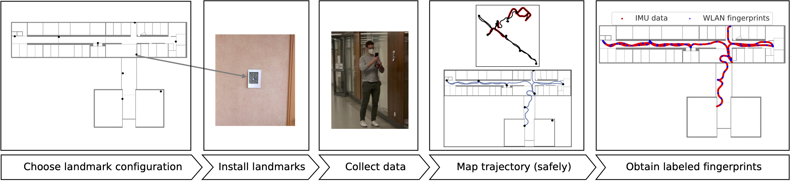

### VI-SLAM2tag



This repository hosts the implementation of the paper

> M. Laska, T. Schulz, J. Grottke, C. Blut and J. Blankenbach, "VI-SLAM2tag: Low-Effort Labeled Dataset Collection for Fingerprinting-Based Indoor Localization," To appear at 2022 International Conference on Indoor Positioning and Indoor Navigation (IPIN), 5 - 7 Sep. 2022, Beijing, China, doi: [10.48550/arXiv.2207.02668](https://doi.org/10.48550/arXiv.2207.02668).

Fingerprinting-based localization is a technique that requires labeled sensor data, where the label is the position of collection.
Typically this data is collected in a site survey, where fingerprints are manually tagged by the collector.
This paper proposes a solution for low-effort labeled data collection by leveraging Android ARCore for automatically obtaining ground truth positions for collected fingerprints.

The implementation is split into two major software components:
- The Android smartphone app for data collection (this repository)
- The postprocessing module for mapping from the local coordinate system of ARCore to the real-world coordinate system (hosted in [VI-SLAM2tag_post](https://github.com/laskama/VI-SLAM2tag_post))

For a precise explanation on the provided software, please refer to the detailed description within the paper.

#### Installation
Build a custom .apk file via the AndroidStudio build option. Place the .apk on the smartphone and open it for installation.
The app requires that Google Play Services for AR is already installed on the device. If this is not the case, please install via the PlayStore.

#### Basic usage
When opening the app for the first time, make sure you grant the required permissions (camera access and location access for scanning WLAN).
If the app is started, it starts recording immediately, however, in post-processing the initial trajectory until the first landmark was seen is discarded.
To stop data collection the app has to be killed. The recorded trajectories can be found within the data folder of the application in the format
as required by the [post-processing module](https://github.com/laskama/VI-SLAM2tag_post).

Data annotation is more accurate if enough landmarks are scanned (at least after each critical turn). When a landmark is seen for the first time,
a hint is displayed the signals the landmark-ID. If the same landmark is seen another time, no user feedback will be given. 

#### WLAN scanning frequency
The app request a new scan, every time the previously issued scan has successfully finished. From Android version >8, the scanning ability
was throttled allowing for maximum 4 scans / 2 minutes. Android version >=10 allows for deactivating the throttling through the "Developer options". 
Please make sure not have Android version >=10 and deactivate WLAN scan throttling for maximal WLAN scanning frequency. 

#### Control-point based validation
In order to conduct labeling accuracy experiments as described in section VI-A, set ```CP_VALIDATION_ENABLED = true;``` in the header of ```VIslam2tagActivity```. 
A "Control-Point" button appears, which can be pressed every time a control point is passed.
This will log the timestamp, which is later used for matching the estimated position with the true position of the control point.
Note that the true location of the control points have to be given in the required building coordinate system.

#### Augmented images as landmarks
For mapping the local trajectory logged via the App, preinstalled landmarks must be regularly scanned with the camera. Several example landmark images are contained in the ```assests/pictures``` folder. Those are used for creating
an augmented image database (```myimages.imgdb```). To use custom landmark images, please inspect the ARCore documentation on Augmented Images.

#### Acknowledgements

This app heavily builds on the example code of the computer_vision example provided by the Google ARCore developers. 
